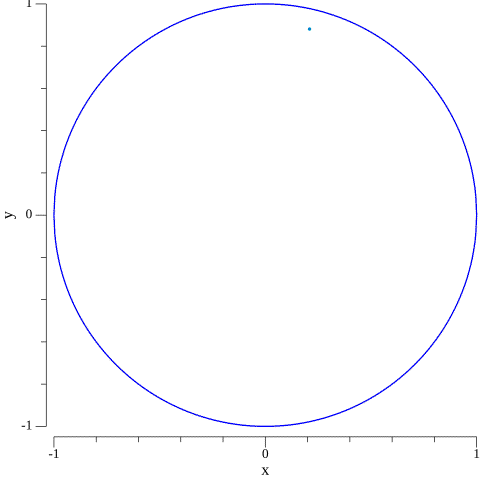
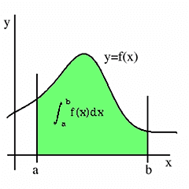

##  Monte Carlo Simulation

```sh
Monte Carlo methods consists of broad class of computational algorithms, that rely on repeated random sampling
to obtain numberical results.

The underlying concept is to use randomness to solve problems that might be
deterministic in principle.

Monte Carlo methods vary but tend to follow a particular pattern :
1. Define a domain of possible inputs.
2. Generate inputs randomly from probability distribution over domain.
3. Perform a deterministic computation on the inputs.
4. Aggregate the results.
```

### Examples

#### 1. Estimation of π


```sh
Estimation of π , consider a quadrant inscribed in a unit square. r=1/2

1. Draw a square then inscribe a quadrant within it.

2. Uniformly scatter the points over the square.

3. Count the number of points in the quadrant that is having a distance from origin of less than 1.

4. The ratio of the inside-count and the total-sample-count is an estimate of the ratio of the two areas,
π/4. Multiply the result by 4 to estimate π.

Hint: The basic equation of a circle is x^2 + y^2 = r^2.

(x,y) will fall inside the circular region if x^2+y^2<1.

area(circle)    no. of points generated inside the cirlce
------------ =  ------------------------------------------
area(square)    total no. of points generated inside square

        no. of points inside cirlce
π = 4 * ---------------------------
        no. of points inside square
```

#### 2. Estimation of '__e__'
```sh
Choose a random number between  and 1 and record its value. Keep doing it until the sum of the numbers exceeds 1
```

#### 3. Birthday Paradox
```sh
In probability theory, the birthday problem or birthday paradox concerns the probability that,
in a set of n randomly chosen people, some pair of them will have the same birthday. 
In a group of 23 people, the probability of a shared birthday exceeds 50%, while a group of
70 has a 99.9% chance of a shared birthday.
```

#### 4. Integration


